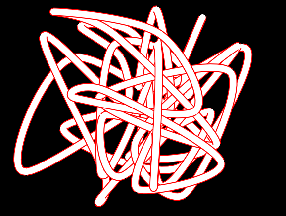

# pofVGpath

pofVGpath is a Pof port of [ofxNanoVG](https://github.com/satoruhiga/ofxNanoVG), itself using [nanovg](https://github.com/memononen/nanovg).

This is work in progress.

It allows to draw "fat" paths, with colored outline:

